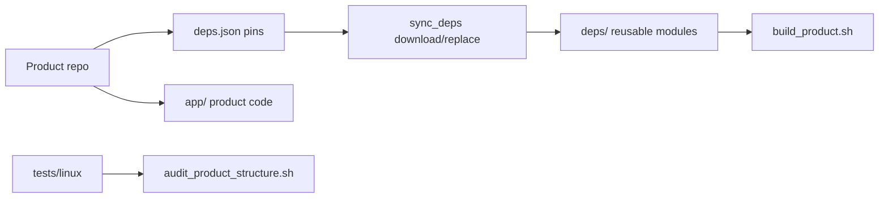
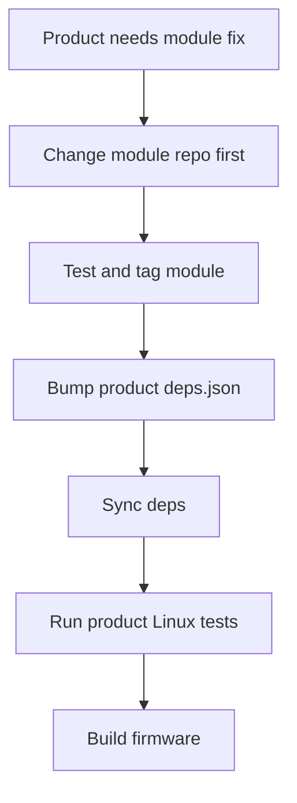

# dephy_repo_golden_sample

Golden sample for Dephy product application repositories.

## Overview

This repo is the executable reference for product app structure. Product repos
compose pinned modules, own product behavior, and keep reusable logic out of
`app/src/`.

## Key Value

- Defines product repo layout: `app/`, `deps.json`, scripts, tests, docs.
- Validates dependency pinning, local replace, and Zephyr build inputs.
- Provides `scripts/audit_product_structure.sh` for drift checks.
- Documents the rule that reusable behavior belongs in module repos first.

## How To Use

```sh
./scripts/sync_deps.sh download
./scripts/sync_deps.sh replace
./scripts/build_product.sh --dry-run
make -C tests/linux test
scripts/audit_product_structure.sh ../mqtt_field_bridge_app
```

## Architecture Flow



## Example User Scenario



## Simple Principle

Products compose modules. Modules own reusable behavior.

## Systematic Regression Testing

From the workspace root, run the shared pytest regression module:

```sh
../dephy_testkit/.venv/bin/python -m pytest ../dephy_testkit/tests/regression --module dephy_repo_golden_sample
../dephy_testkit/.venv/bin/python -m pytest ../dephy_testkit/tests/regression --module dephy_repo_golden_sample --profile integration
```

The local repo tests remain:

```sh
sh scripts/audit_product_structure.sh .
make -C tests/linux test
```

`make -C tests/linux test` is the canonical local entry point and must trigger
its suites through `dephy_testkit` via `tests/linux/trigger_testkit.sh`. When a
test case or script changes, update the matching Makefile target and the
`testkit-*` wrapper in the same change.

## Docs

- `docs/product_structure.md`: product repo contract.
- `docs/validation.md`: validation commands and build flow.
- `docs/todo.md`: current TODO summary.

## License

MIT. See `LICENSE` and `NOTICE.md`. Reuse and references are allowed, but the
copyright notice and attribution to Judd (judadao) must be preserved.
